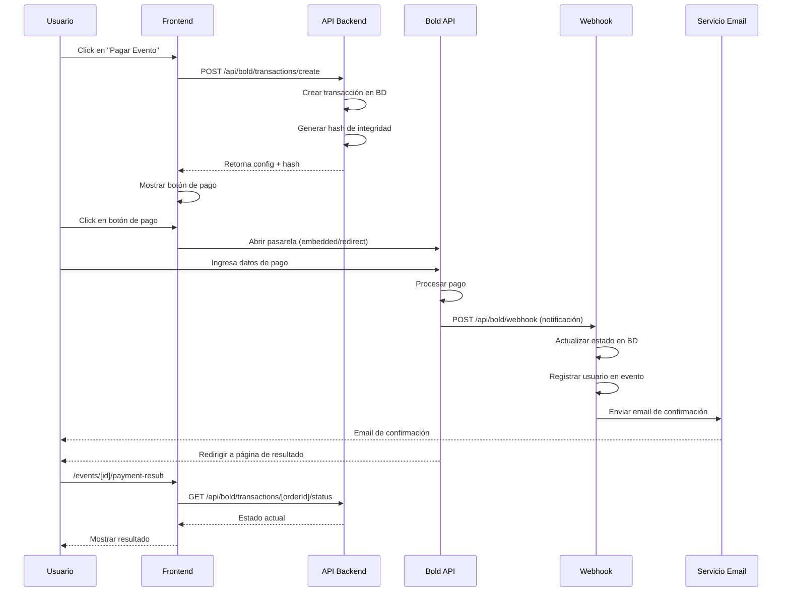

# Integración de Pasarela de Pagos Bold

## 📋 Descripción General

Esta documentación describe la integración completa de la pasarela de pagos Bold en BSK Motorcycle Team para el procesamiento de pagos de eventos.

## 🎯 Características Implementadas

### 1. **Botón de Pago Personalizado**
- Botón con diseño personalizado que mantiene la identidad de marca de BSK
- Integración con Embedded Checkout (modal dentro del sitio)
- Soporte para redirección a pasarela externa
- Manejo automático de carga del script Bold
- Indicadores de carga y estado

### 2. **Sistema de Transacciones**
- Modelo de base de datos para registrar todas las transacciones
- Generación automática de IDs de orden únicos
- Cálculo automático de impuestos (IVA 19%)
- Hash de integridad para seguridad

### 3. **Webhook para Notificaciones**
- Endpoint que recibe notificaciones automáticas de Bold
- Actualización en tiempo real del estado de transacciones
- Registro automático de usuarios en eventos al aprobar el pago
- Envío de correos de confirmación

### 4. **Consulta de Estado**
- API para consultar estado de transacciones
- Integración con API de Bold para verificación
- Página de resultado de pago con estado actualizado

### 5. **Notificaciones por Email**
- Confirmación de pago aprobado con detalles completos
- Notificación de pago rechazado
- Diseño HTML profesional y responsive

## 📁 Estructura de Archivos

```
/workspaces/LandingPage/
├── lib/
│   ├── bold-utils.ts                          # Utilidades para Bold
│   └── models/
│       └── BoldTransaction.ts                 # Modelo de transacciones
│
├── components/
│   └── shared/
│       └── BoldCheckoutButton.tsx             # Componente del botón de pago
│
├── app/
│   ├── api/
│   │   └── bold/
│   │       ├── transactions/
│   │       │   ├── create/route.ts            # Crear transacción
│   │       │   └── [orderId]/
│   │       │       └── status/route.ts        # Consultar estado
│   │       └── webhook/route.ts               # Recibir notificaciones Bold
│   │
│   └── events/
│       └── [id]/
│           └── payment-result/
│               └── page.tsx                    # Página de resultado de pago
│
└── docs/
    └── BOLD_INTEGRATION.md                     # Esta documentación
```

## 🔧 Configuración

### Variables de Entorno Requeridas

Agregar al archivo `.env` o `.env.local`:

```bash
# Bold Payment Gateway Configuration
BOLD_API_KEY=tu_llave_de_identidad_bold
BOLD_SECRET_KEY=tu_llave_secreta_bold
BOLD_ENVIRONMENT=sandbox  # o "production"

# URLs de la aplicación
NEXT_PUBLIC_APP_URL=https://bskmt.com
```

### Obtener las Llaves de Bold

1. Inicia sesión en [Bold](https://bold.co)
2. Ve a **Panel de Control** → **Configuración** → **Llaves de Integración**
3. Copia:
   - **Llave de Identidad** (API Key)
   - **Llave Secreta** (Secret Key)

#### Ambiente de Pruebas

Para pruebas, usa las llaves de **sandbox/pruebas**:
- Todas las transacciones serán simuladas
- No se harán cargos reales
- Aparecerá "Modo de pruebas" en la pasarela

#### Ambiente de Producción

Para producción, usa las llaves de **producción**:
- Las transacciones serán reales
- Se procesarán pagos reales
- Asegúrate de configurar correctamente

## 🚀 Uso en un Evento

### 1. Preparar el Evento para Pagos

El evento debe tener configurado el campo `price` en la base de datos:

```javascript
{
  name: "Rodada a Melgar",
  price: 50000,  // Precio en COP
  // ... otros campos
}
```

### 2. Integrar el Botón en la Página del Evento

Ejemplo de cómo agregar el botón de pago en `/app/events/[id]/page.tsx`:

```typescript
import { useState } from 'react';
import BoldCheckoutButton from '@/components/shared/BoldCheckoutButton';

// En tu componente
const [paymentConfig, setPaymentConfig] = useState(null);
const [integritySignature, setIntegritySignature] = useState('');

// Función para inicializar el pago
const handlePaymentClick = async () => {
  try {
    const response = await fetch('/api/bold/transactions/create', {
      method: 'POST',
      credentials: 'include',
      headers: {
        'Content-Type': 'application/json'
      },
      body: JSON.stringify({
        eventId: event._id
      })
    });

    const data = await response.json();
    
    if (data.success) {
      setPaymentConfig(data.data.paymentConfig);
      setIntegritySignature(data.data.integritySignature);
    }
  } catch (error) {
    console.error('Error creating transaction:', error);
  }
};

// Renderizar el botón
{event.price && event.price > 0 && paymentConfig && (
  <BoldCheckoutButton
    config={paymentConfig}
    integritySignature={integritySignature}
    buttonText={`Pagar ${formatCurrency(event.price)}`}
    renderMode="embedded"
    onPaymentStart={() => console.log('Payment started')}
    onPaymentSuccess={() => console.log('Payment successful')}
    onPaymentError={(error) => console.error('Payment error:', error)}
  />
)}
```

## 🔄 Flujo Completo de Pago



## 📊 Estados de Transacción

| Estado | Descripción | Acción |
|--------|-------------|--------|
| `PENDING` | Pago pendiente de confirmación | Esperar |
| `PROCESSING` | Pago en proceso | Esperar |
| `APPROVED` | Pago aprobado ✅ | Usuario registrado en evento |
| `REJECTED` | Pago rechazado ❌ | Mostrar opción de reintentar |
| `FAILED` | Pago fallido ⚠️ | Mostrar opción de reintentar |
| `VOIDED` | Pago anulado 🚫 | Remover usuario del evento |

## 🔐 Seguridad

### Hash de Integridad

Cada transacción incluye un hash SHA256 calculado con:
```
hash = SHA256(orderId + amount + currency + secretKey)
```

Este hash:
- Se genera en el servidor (nunca en el cliente)
- Valida que los datos no fueron modificados
- Previene manipulación de montos

### Validaciones Implementadas

1. **Autenticación**: Usuario debe estar autenticado
2. **Cupos**: Verifica disponibilidad antes de crear transacción
3. **Duplicados**: Previene pagos duplicados para el mismo evento
4. **Montos**: Valida monto mínimo ($1,000 COP)
5. **Webhook**: Verifica que la transacción existe antes de actualizar

## 🧪 Pruebas

### Datos de Prueba

En ambiente **sandbox**, usa:

**Tarjetas de crédito:**
- Pago aprobado (VISA): `4111111111111111`
- Pago aprobado (MasterCard): `5100010000000015`
- Pago rechazado: `4970110000000062`
- Pago fallido: `5204730000008404`

**PSE:**
- Seleccionar "BANCO QUE APRUEBA" para aprobado
- Seleccionar "BANCO QUE RECHAZA" para rechazado
- Seleccionar "BANCO QUE SIMULA UN ERROR" para fallido

**Datos personales:**
- Puedes usar cualquier dato (no se procesará realmente)
- CVV: Cualquier 3 dígitos
- Fecha de expiración: Cualquier fecha futura

### Verificar la Integración

1. **Crear transacción:**
   ```bash
   curl -X POST https://bskmt.com/api/bold/transactions/create \
     -H "Content-Type: application/json" \
     -H "Cookie: bsk-access-token=..." \
     -d '{"eventId": "EVENT_ID_AQUI"}'
   ```

2. **Verificar webhook:**
   ```bash
   curl https://bskmt.com/api/bold/webhook
   ```

3. **Consultar estado:**
   ```bash
   curl https://bskmt.com/api/bold/transactions/ORDER_ID/status \
     -H "Cookie: bsk-access-token=..."
   ```

## 📧 Configurar Webhook en Bold

Para recibir notificaciones automáticas:

1. Inicia sesión en [Bold](https://comercios.bold.co)
2. Ve a **Configuración** → **Webhooks**
3. Agrega la URL:
   ```
   https://bskmt.com/api/bold/webhook
   ```
4. Guarda la configuración

### Probar Webhook

En ambiente de pruebas, después de completar una compra:
1. Verás un botón "Probar el webhook"
2. Ingresa la URL del webhook
3. Bold enviará una petición de prueba

## 💡 Mejores Prácticas

### 1. Manejo de Errores
- Siempre mostrar mensajes claros al usuario
- Registrar errores en logs para análisis
- Proporcionar opciones de recuperación

### 2. Experiencia de Usuario
- Usar `renderMode="embedded"` para mejor UX
- Mostrar indicadores de carga
- Confirmar siempre con email

### 3. Seguridad
- Nunca exponer la llave secreta en el frontend
- Validar siempre en el servidor
- Verificar webhook signatures (si Bold lo implementa)

### 4. Monitoreo
- Revisar regularmente las transacciones pendientes
- Configurar alertas para pagos fallidos frecuentes
- Mantener logs de todas las transacciones

## 🐛 Solución de Problemas

### Error: "Bold secret key is not configured"
**Solución:** Verifica que `BOLD_SECRET_KEY` esté en `.env`

### Error: "Script failed to load"
**Solución:** 
- Verifica la conexión a internet
- Revisa la consola del navegador
- Asegúrate de que no hay bloqueadores de scripts

### Webhook no recibe notificaciones
**Solución:**
1. Verifica que la URL del webhook esté correctamente configurada en Bold
2. Verifica que la URL sea accesible públicamente (no localhost)
3. Revisa los logs del servidor

### Transacción queda en PENDING
**Solución:**
- Esto es normal para PSE (puede tardar minutos)
- El webhook actualizará el estado automáticamente
- Usuario puede refrescar la página de resultado

## 📞 Soporte

### Bold
- Portal de comercios: https://comercios.bold.co
- Documentación: https://bold.co/docs
- Soporte: soporte@bold.co

### BSK Motorcycle Team
- Crear un ticket interno
- Revisar logs en `/var/log/bold-transactions.log`
- Consultar transacciones en MongoDB

## 📝 Notas Adicionales

### Límites de Monto

Bold tiene límites por comercio:
- **Mínimo**: $1,000 COP
- **Máximo**: Verificar en el panel de Bold

Para aumentar límites, contactar a Bold.

### Comisiones

Bold cobra una comisión por transacción. Consulta:
- Panel de Bold → Tarifas
- Tu contrato con Bold

### Divisas Soportadas

- **COP** (Peso colombiano) - Principal
- **USD** (Dólar estadounidense) - Se convierte a COP según TRM

## ✅ Checklist de Implementación

- [ ] Configurar variables de entorno
- [ ] Obtener llaves de Bold (sandbox y producción)
- [ ] Probar en ambiente sandbox
- [ ] Configurar webhook en Bold
- [ ] Probar flujo completo de pago
- [ ] Verificar emails de confirmación
- [ ] Probar diferentes estados (aprobado, rechazado, fallido)
- [ ] Cambiar a llaves de producción
- [ ] Hacer transacción de prueba real (monto pequeño)
- [ ] Documentar proceso interno
- [ ] Capacitar al equipo

## 📅 Fecha de Implementación

Octubre 2, 2025

## 👨‍💻 Desarrollador

Implementado para BSK Motorcycle Team

---

**¡La integración de Bold está completa y lista para usar!** 🎉
