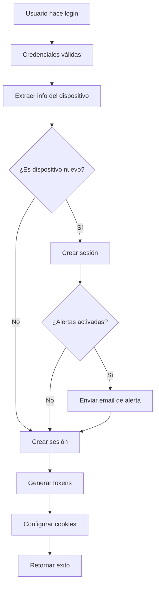

# Implementación de Alertas de Seguridad por Login

## Descripción General

Sistema completo de alertas de seguridad que notifica a los usuarios por correo electrónico cuando se detecta un inicio de sesión desde un dispositivo nuevo o desconocido.

## Características Implementadas

### 1. Modelo de Datos

**ExtendedUser** (`lib/models/ExtendedUser.ts`)
- Nuevo campo: `securityAlerts: boolean` (por defecto `true`)
- Almacena la preferencia del usuario sobre recibir alertas de seguridad

### 2. API de Gestión de Preferencias

**Endpoint:** `/api/user/security-alerts`

#### GET - Obtener preferencias
```typescript
GET /api/user/security-alerts
Response: {
  success: true,
  data: {
    securityAlerts: boolean
  }
}
```

#### PATCH - Actualizar preferencias
```typescript
PATCH /api/user/security-alerts
Body: {
  securityAlerts: boolean
}
Response: {
  success: true,
  message: "Alertas de seguridad activadas/desactivadas correctamente",
  data: {
    securityAlerts: boolean
  }
}
```

### 3. Detección de Nuevos Dispositivos

**Función:** `checkIfNewDevice()` en `/app/api/auth/login/route.ts`

**Lógica:**
1. Busca sesiones activas previas del usuario
2. Compara firma del dispositivo actual: `browser-os-device`
3. Si no encuentra coincidencias, identifica como nuevo dispositivo
4. Retorna `true` si es nuevo, `false` si ya existe

**Ejemplo de firma:**
```
Chrome-Windows-Desktop
Safari-macOS-Desktop
Chrome-Android-Mobile
```

### 4. Sistema de Notificación por Email

**Servicio:** `EmailService` en `lib/email-service.ts`

#### Nuevo método: `sendSecurityAlert()`
```typescript
async sendSecurityAlert(
  userEmail: string,
  userName: string,
  loginData: {
    timestamp: string,
    ipAddress?: string,
    device?: string,
    browser?: string,
    os?: string,
    location?: string
  }
): Promise<boolean>
```

**Template del Email:**
- Diseño profesional con colores de alerta (rojo)
- Detalles completos del login:
  - Fecha y hora (zona horaria Colombia)
  - Dispositivo, navegador, sistema operativo
  - Dirección IP
  - Ubicación (opcional)
- Botones de acción:
  - "Asegurar mi cuenta" → `/dashboard/security`
  - "Cambiar contraseña" → `/reset-password`
- Mensaje tranquilizador si fue el usuario
- Consejos de seguridad

### 5. Integración en el Flujo de Login

**Archivo:** `/app/api/auth/login/route.ts`

**Proceso:**
1. Usuario ingresa credenciales válidas
2. Sistema extrae información del dispositivo
3. **NUEVO:** Verifica si es dispositivo nuevo
4. Crea sesión en la base de datos
5. **NUEVO:** Si es nuevo dispositivo → `sendSecurityAlertIfEnabled()`
6. Genera tokens JWT
7. Configura cookies
8. Retorna respuesta exitosa

**Función:** `sendSecurityAlertIfEnabled()`
- Busca usuario en ExtendedUser
- Si `securityAlerts === false`, no envía email
- Si `securityAlerts === true` o usuario no tiene preferencia → envía email
- No interrumpe el flujo de login si falla el envío (try/catch)

### 6. Interfaz de Usuario

**Componente:** `AdvancedSettingsSection.tsx`

**Ubicación:** `/dashboard/security` → Tab "Seguridad y Configuración"

**Funcionalidades:**
- Toggle switch para activar/desactivar alertas
- Carga preferencias desde API al montar
- Actualización optimista (cambia UI inmediatamente)
- Revertir en caso de error
- Estados de carga con spinner
- Toasts de confirmación/error

**Estados:**
- `isLoadingAlerts`: Cargando preferencias
- `securityAlerts`: Estado actual del toggle

## Flujo Completo



## Casos de Uso

### Caso 1: Primer Login (Dispositivo Nuevo)
```
Usuario: Juan Pérez
Email: juan@example.com
Dispositivo: Chrome en Windows (nunca usado antes)
Resultado: ✅ Email de alerta enviado
```

### Caso 2: Login desde Dispositivo Conocido
```
Usuario: Juan Pérez
Dispositivo: Chrome en Windows (usado antes)
Resultado: ❌ NO se envía email (dispositivo conocido)
```

### Caso 3: Usuario con Alertas Desactivadas
```
Usuario: María García
securityAlerts: false
Dispositivo: Nuevo iPhone Safari
Resultado: ❌ NO se envía email (preferencia desactivada)
```

### Caso 4: Cambio de Preferencias
```
Usuario va a /dashboard/security
Toggle: OFF → ON
Resultado: ✅ Preferencia guardada en DB
Próximo login nuevo: ✅ Recibirá alertas
```

## Seguridad

### Protecciones Implementadas

1. **Autenticación Requerida**
   - API de preferencias requiere token JWT válido
   - Usuarios solo pueden ver/modificar sus propias preferencias

2. **Validación de Datos**
   - Campo `securityAlerts` debe ser booleano
   - Validación en servidor antes de guardar

3. **Migración Automática**
   - Si usuario no existe en ExtendedUser, se crea automáticamente
   - Valores por defecto seguros (alertas activadas)

4. **No Interrumpe Login**
   - Fallo en envío de email no bloquea acceso
   - Errores registrados en logs para debugging

5. **Rate Limiting**
   - Login ya tiene rate limiting (5 intentos/15 min)
   - Protege contra spam de emails

## Configuración

### Variables de Entorno
```env
# Base URL para enlaces en emails
NEXT_PUBLIC_BASE_URL=https://bskmt.com

# Zoho Mail API (ya configurado)
ZOHO_CLIENT_ID=tu_client_id
ZOHO_CLIENT_SECRET=tu_client_secret
ZOHO_REFRESH_TOKEN=tu_refresh_token
ZOHO_FROM_EMAIL=noreply@bskmt.com
ZOHO_ADMIN_EMAIL=admin@bskmt.com
```

### Valores por Defecto
```typescript
securityAlerts: true  // Usuarios nuevos tienen alertas activadas
```

## Testing

### Pruebas Manuales

1. **Activar/Desactivar Alertas**
```bash
# Navegar a https://bskmt.com/dashboard/security
# Ir a tab "Seguridad y Configuración"
# Toggle switch de "Alertas de login desde nuevos dispositivos"
# Verificar toast de confirmación
# Recargar página → debe mantener estado
```

2. **Probar Detección de Nuevo Dispositivo**
```bash
# Login desde Chrome en Windows → guardar sesión
# Logout
# Login desde Firefox en Windows → debería enviar email
# Login nuevamente desde Chrome → NO debería enviar email
```

3. **Verificar Email Recibido**
```bash
# Revisar bandeja de entrada
# Email debe incluir:
#   - Detalles del dispositivo
#   - Fecha y hora correcta
#   - Botones funcionando
#   - Formato responsive
```

### Pruebas de API

```bash
# Obtener preferencias
curl -X GET https://bskmt.com/api/user/security-alerts \
  -H "Authorization: Bearer YOUR_TOKEN"

# Actualizar preferencias
curl -X PATCH https://bskmt.com/api/user/security-alerts \
  -H "Content-Type: application/json" \
  -H "Authorization: Bearer YOUR_TOKEN" \
  -d '{"securityAlerts": false}'
```

## Logs y Monitoreo

### Mensajes de Log

```typescript
// Login exitoso con nuevo dispositivo
console.log(`Alerta de seguridad enviada a ${user.email}`)

// Error en envío
console.error('Error enviando alerta de seguridad:', error)

// Error verificando dispositivo
console.error('Error verificando nuevo dispositivo:', error)
```

### Qué Monitorear

1. **Tasa de envío de emails**
   - Muchos emails → posible ataque o bug
   
2. **Fallos en envío**
   - Problemas con Zoho API
   - Verificar credenciales

3. **Usuarios sin ExtendedUser**
   - Migración automática funcionando
   - Logs de creación de registros

## Mantenimiento

### Actualizar Template de Email

Archivo: `lib/email-service.ts` → `generateSecurityAlertContent()`

Modificar:
- Estilos CSS inline
- Textos y mensajes
- Enlaces de botones
- Información mostrada

### Ajustar Detección de Dispositivos

Archivo: `/app/api/auth/login/route.ts` → `checkIfNewDevice()`

Opciones:
- Incluir IP en firma (más estricto)
- Solo browser (más permisivo)
- Agregar geolocalización
- Aumentar ventana de sesiones (actualmente 10)

### Cambiar Valores por Defecto

Archivo: `lib/models/ExtendedUser.ts`

```typescript
securityAlerts: { type: Boolean, default: false }  // Desactivar por defecto
```

## Mejoras Futuras

### Corto Plazo
- [ ] Agregar geolocalización por IP
- [ ] Mostrar mapa de ubicación en email
- [ ] Lista de dispositivos confiables en dashboard

### Mediano Plazo
- [ ] Notificaciones push (PWA)
- [ ] SMS/WhatsApp para alertas críticas
- [ ] Permitir aprobar/rechazar dispositivo desde email

### Largo Plazo
- [ ] Autenticación de dos factores (2FA)
- [ ] Detección de comportamiento anómalo
- [ ] Machine learning para dispositivos sospechosos

## Soporte

### Problemas Comunes

**No llega email de alerta:**
1. Verificar `securityAlerts === true` en DB
2. Revisar logs de servidor
3. Verificar configuración Zoho Mail
4. Comprobar bandeja de spam

**Alerta en dispositivo conocido:**
1. Usuario cambió navegador/versión
2. Sesiones expiradas limpiadas
3. Ajustar lógica de firma de dispositivo

**Toggle no guarda preferencia:**
1. Verificar token JWT válido
2. Revisar logs de API
3. Comprobar conexión a MongoDB

## Referencias

- [Documentación Zoho Mail API](https://www.zoho.com/mail/help/api/)
- [Next.js API Routes](https://nextjs.org/docs/app/building-your-application/routing/route-handlers)
- [Mongoose Schemas](https://mongoosejs.com/docs/guide.html)
- [JWT Authentication](https://jwt.io/introduction)

---

**Autor:** GitHub Copilot  
**Fecha:** Octubre 2025  
**Versión:** 1.0.0  
**Estado:** ✅ Implementado y funcional
